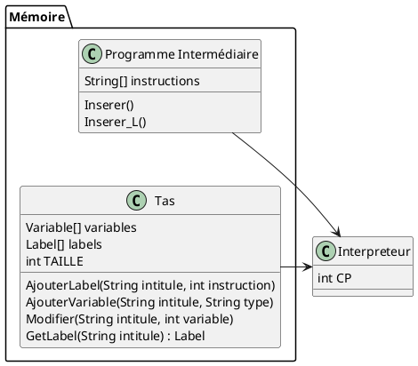
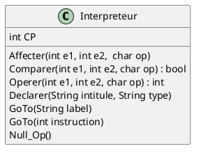
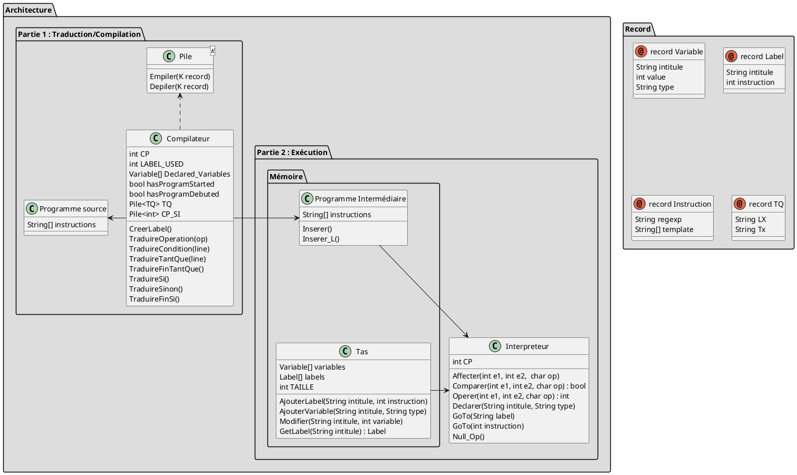

# Compilateur de code

## Compiler le programme

```sh
# Linux command
gnatmake src/main $(ls -R  | grep -oP 'src/.*(?=:)' | sed -e 's_.*_-I&_' | paste -s)

# Or use the command file
./compile
```

### Explication
Le projet étant découpé en plusieurs modules partagés dans des dossiers différents, il est nécessaire de spécifier l'emplacement de l'ensemble de ces dossiers lors de la compilation du programme.

```sh
ls -R # Affiche la liste des répertoires (sous la forme "chemin/du/dossier:") et leur contenu

grep -oP 'src/.*(?=:)'  # Récupère la liste des dossiers (recherche une chaine finissant par ":" en excluant ce dernier)

sed -e 's_.*_-I&_' # Rajoute à chaque début de chaines "-I"

paste -s # Transforme les lignes en espace


### EXEMPLE DE RESULTAT ###
gnatmake src/main -Isrc/compiler -Isrc/files -Isrc/files/intermediate -Isrc/files/source -Isrc/struct -Isrc/struct/liste -Isrc/struct/object -Isrc/struct/pile
```

## Compilation du programme source

### Analyse sémantique

| Motif | Règle |
| ----------- | ----------- |
| - -  | Tout caractère après ce motif est autorisé |
| Programme \<name> est | Variable **isInProgram** = true
| \<variable> : \<Type> | Vérifier que **isInProgram** = true ET que **isDebut** = false<br/> Vérifier que Type existe <br/> Vérifier que variable n'est pas déjà déclaré |
| Début | Vérifier que **isInProgram** = true <br/> Variable **isDebut** = true |
| \<variable> <- \<valeur> | Vérifier que variable est déclaré <br> Vérifier le type de la valeur |
| \<variable \| constante> \<op> \<variable \| constante> | Vérifier que op existe <br> Ajouter des variables intermédiaires (condition) <br> Ajouter des lignes |
| Tant Que \<condition> Faire | Isoler et traiter la condition <br/> Créer des labels <br/> Ajouter des branchements |

## Interprétation du programme intermédiaire

### Représentation de la mémoire

Dans cet exemple, nous considérons une version simplifiée de la gestion de la mémoire, contenant seulement un espace réservé au programme, et le tas pour les différentes variables. <br/>
Le programme est lu par un interpréteur externe (qui accède à son espace mémoire), qui exécutera le programme et accèdera éventuellement au tas pour enregistrer et lire des variables stockées.


On se basera sur cette interprétation afin d'implémenter nos différents modules.



### Analyse sémantique

En analysant le code intermédiaire de notre programme, nous pouvons identifier différents mots clés et opérations :

| Programme      | Opérations |
| ----------- | ----------- |
| n **←** 5     | Affectation       |
| i ← 1   |         |
| Fact ← 1   |         |
| T1 ← **i < n**   | Comparaison        |
| i ← **i + 1**   |  Opération       |
| **IF** T3 **GO TO** L1  |  Condition / Branchement       |
| **NULL**  |  Null       |

### Raffinage

**<R0\> :** Comment **Interpréter et exécuter un code intermédiaire** ?

- Charger le fichier
- POUR CHAQUE LIGNE :
  - Vérifier et appliquer les règles d'exécution (\<R1>)

**<R1\> :** Comment **Vérifier et appliquer les règles d'exécution** ? 

- SI _Vérifier **commentaire**_ (\<R2.1>) ALORS :
    - _Appliquer **commentaire**_ (\<R2.1bis>)
- SI _Vérifier **déclaration**_ (\<R2.2>) ALORS :
    - _Appliquer **déclaration**_ (\<R2.2bis>)
- SI _Vérifier **affectation**_ (\<R2.3>) ALORS :
    - _Appliquer **affectation**_ (\<R2.3bis>)
- SI _Vérifier **opération**_ (\<R2.4>) ALORS :
    - _Appliquer **opération**_ (\<R2.4bis>)
- SI _Vérifier **comparaison**_ (\<R2.5>) ALORS :
    - _Appliquer **comparaison**_ (\<R2.5bis>)
- SI _Vérifier **condition**_ (\<R2.6>) ALORS :
    - _Appliquer **condition**_ (\<R2.6bis>)
- SI _Vérifier **branchement**_ (\<R2.7>) ALORS :
    - _Appliquer **branchement**_ (\<R2.7bis>)
- SI _Vérifier **Null**_ (\<R2.8>) ALORS :
    - _Appliquer **Null**_ (\<R2.8bis>)

Après analyse, nous pouvons spécifier de nouvelles fonctions à notre module Interpréteur.



## Architecture globale


