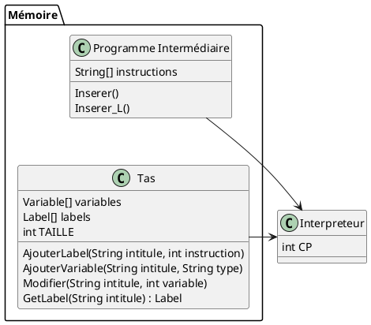
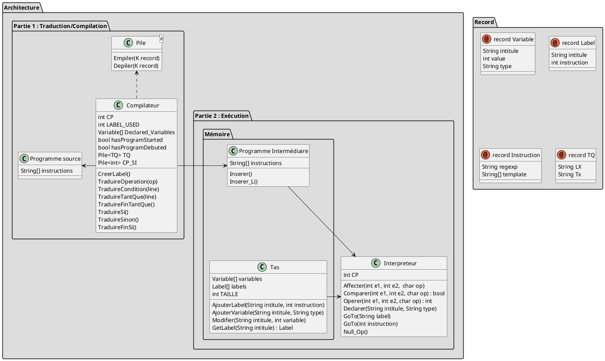

{::options parse_block_html="true" /}

# Compilateur de code

## Compiler le programme

```sh
# Linux command
gnatmake src/main $(ls -R  | grep -oP 'src/.*(?=:)' | sed -e 's_.*_-I&_' | paste -s)

# Or use the command file
./compile
```

### Explication
Le projet étant découpé en plusieurs modules partagés dans des dossiers différents, il est nécessaire de spécifier l'emplacement de l'ensemble de ces dossiers lors de la compilation du programme.

```sh
ls -R # Affiche la liste des répertoires (sous la forme "chemin/du/dossier:") et leur contenu

grep -oP 'src/.*(?=:)'  # Récupère la liste des dossiers (recherche une chaine finissant par ":" en excluant ce dernier)

sed -e 's_.*_-I&_' # Rajoute à chaque début de chaines "-I"

paste -s # Transforme les lignes en espace


### EXEMPLE DE RESULTAT ###
gnatmake src/main -Isrc/compiler -Isrc/files -Isrc/files/intermediate -Isrc/files/source -Isrc/struct -Isrc/struct/liste -Isrc/struct/object -Isrc/struct/pile
```

## Compilation du programme source

## Interprétation du programme intermédiaire

### Architecture

Dans cet exemple, nous considérons une version simplifiée de la gestion de la mémoire, contenant seulement un espace réservé au programme, et le tas pour les différentes variables. <br/>
Le programme est lu par un interpréteur externe (qui accède à son espace mémoire), qui exécutera le programme et accèdera éventuellement au tas pour enregistrer et lire des variables stockées.


On se basera sur cette interprétation afin d'implémenter nos différents modules.



### Analyse sémantique

En analysant le code intermédiaire de notre programme, nous pouvons identifier différents mots clés et opérations :

| Programme      | Opérations |
| ----------- | ----------- |
| n <span style="background-color:#ffff00">←</span> 5      | Affectation       |
| i ← 1   |         |
| Fact ← 1   |         |
| T1 ← i < n   | Comparaison        |
| i ← i + 1   |  Opération       |
| IF T3 GO TO L1  |  Condition / Branchement       |
| NULL  |  Null       |


## Architecture globale


