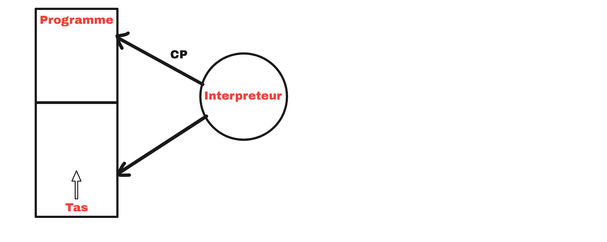
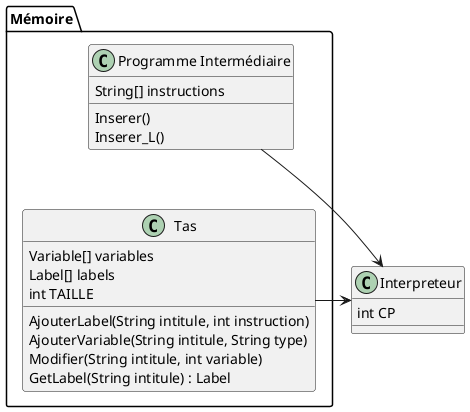
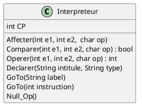
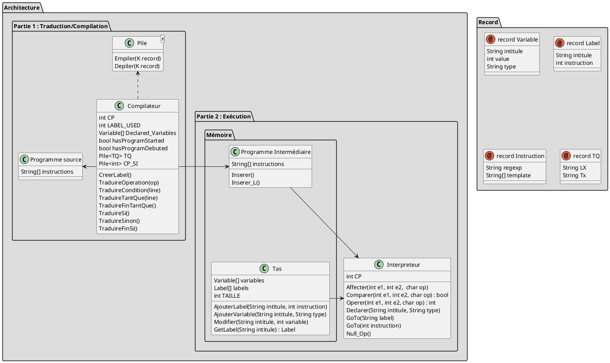

# Le langage de programmation Dato

Ce projet a été fait dans le cadre dun module de programmation impérative enseigné aux premières années du département "Informatique et Réseaux" au sein de l'école ENSEEIHT.

Ce projet s'appuie sur un langage dérivé du langage algorithmique qui est généralement enseigné avec la langue française. Nous l'avons nommé le "Dato" pour "Descriptive Algorithmic & Transcoding Operations" (ou DAmien et TOm 😉).

Le langage propose
- deux types de variables : "Entier" et "Booleen"
- des conditions, avec son implémentation avec le si et la boucle tant que
- l'affichage de chaine de caractère et de variable

Construction :
* Déclaration de variable :
  - test1 : Entier
  - test2 : Booleen
* Affectation de variable :
  - test1 <- 4
  - test2 <- 1
* Operation / Condition :
  - test1 <- 4 + 1
  - test2 <- 1 OU 0

* Condition si :
  - Si test1 = 1 Alors [...] Fin si
* Boucle tant que :
  - Tant que test1 > 0 Faire [...] Fin tant que

* Affichage :
  - Afficher("test1 : " + test1)

Ce projet comporte deux objectifs principaux :
1. Compiler le dato pour extraire le code sous forme d'un langage se rapprochant de l'assembleur
2. Interpreter l'asembleur pour pouvoir l'exécuter

## Le compilateur

### Analyse sémantique

| Motif | Traduction | Règle |
| ----------- | ----------- | ----------- |
| --  | Commentaire | Tout caractère après ce motif est autorisé |
| Programme \<name> est | Commencement du programme | Variable **isProgramStarted** = true
| \<variable> : \<Type> | Déclaration de variable | Vérifier que **isProgramStarted** = true ET que **isDebut** = false<br/> Vérifier que Type existe <br/> Vérifier que variable n'est pas déjà déclaré |
| Début | Début du programme<br/>Les déclarations ne sont plus possibles | Vérifier que **isProgramStarted** = true <br/> Variable **isDebut** = true |
||||
| \<variable> <- \<valeur><br/>\<variable> <- \<variable><br/>\<variable> <- \<operation><br/>\<variable> <- \<condition><br/> | Affectation à une variable | Vérifier que variable est déclaré <br> Vérifier le type de la valeur |
| \<variable \| constante> \<op> \<variable \| constante> | Opération | Vérifier que op existe <br> Ajouter des lignes |
| \<variable \| constante> \<condition> \<variable \| constante> | Condition | Vérifier que cond existe <br> Ajouter des variables intermédiaires (condition) <br> Ajouter des lignes |
||||
| Si \<condition> Alors | Condition Si | Isoler et traiter la condition <br/> Créer des labels <br/> Ajouter des branchements |
| Tant Que \<condition> Faire | Boucle tant que | Isoler et traiter la condition <br/> Créer des labels <br/> Ajouter des branchements |


### Raffinage

Voici le raffinage haut niveau de notre programme de compilation.

**<R0\> :** Comment **Compiler et traduire un code en un langage assembleur** ?

- Charger le fichier
- POUR CHAQUE LIGNE :
  - Vérifier et appliquer les règles d'exécution (\<R1>)

**<R1\> :** Comment **Vérifier et appliquer les règles d'exécution** ? 

- SI _Vérifier **commentaire**_ (\<R2.1>) ALORS :
    - Ne rien faire
- SI _Vérifier **déclaration**_ (\<R2.2>) ALORS :
    - _Appliquer **déclaration**_ (\<R2.2bis>)
- SI _Vérifier **affectation**_ (\<R2.3>) ALORS :
    - _Appliquer **affectation**_ (\<R2.3bis>)
- SI _Vérifier **Si**_ (\<R2.4>) ALORS :
    - _Appliquer **Si**_ (\<R2.4bis>)
- SI _Vérifier **Tant que**_ (\<R2.5>) ALORS :
    - _Appliquer **Tant que**_ (\<R2.5bis>)
- SI _Vérifier **Afficher**_ (\<R2.6>) ALORS :
    - _Appliquer **Afficher**_ (\<R2.6bis>)

**<R2.2bis\> :** Comment **Appliquer déclaration** ?
- _Vérifier la non-existance de la variable_
- _Créer la variable_

**<R2.3bis\> :** Comment **Appliquer affectation** ?
- SI _Opération_ ALORS :
    - _Traiter opération_
    - _Affecter opération_
- SI _Condition_ ALORS :
    - _Traiter condition_
    - _Affecter condition_
- SI _Variable_ ALORS :
    - _Vérifier l'existance de la variable_
    - _Vérifier le type_
    - _Récupérer la valeur de la variable_
    - _Affecter variable_
- SI _Valeur_ ALORS :
    - _Vérifier le type_
    - _Affecter valeur_

**<R2.4bis\> :** Comment **Appliquer si** ?
- _Traiter branchement_

**<R2.5bis\> :** Comment **Appliquer tant que** ?
- _Traiter branchement_

## Interprétation du programme intermédiaire (l'assembleur)

### Représentation de la mémoire

Dans cet exemple, nous considérons une version simplifiée de la gestion de la mémoire, contenant seulement un espace réservé au programme, et le tas pour les différentes variables. <br/>
Le programme est lu par un interpréteur externe (qui accède à son espace mémoire), qui exécutera le programme et accèdera éventuellement au tas pour enregistrer et lire des variables stockées.



On se basera sur cette interprétation afin d'implémenter nos différents modules.



### Analyse sémantique

En analysant le code intermédiaire de notre programme, nous pouvons identifier différents mots clés et opérations :

| Programme      | Opérations |
| ----------- | ----------- |
| n **←** 5     | Affectation       |
| i ← 1   |         |
| Fact ← 1   |         |
| T1 ← **i < n**   | Comparaison        |
| i ← **i + 1**   |  Opération       |
| **IF** T3 **GO TO** L1  |  Condition / Branchement       |
| **NULL**  |  Null       |

### Raffinage

**<R0\> :** Comment **Interpréter et exécuter un code intermédiaire** ?

- Charger le fichier
- POUR CHAQUE LIGNE :
  - Vérifier et appliquer les règles d'exécution (\<R1>)

**<R1\> :** Comment **Vérifier et appliquer les règles d'exécution** ? 

- SI _Vérifier **commentaire**_ (\<R2.1>) ALORS :
    - _Appliquer **commentaire**_ (\<R2.1bis>)
- SI _Vérifier **déclaration**_ (\<R2.2>) ALORS :
    - _Appliquer **déclaration**_ (\<R2.2bis>)
- SI _Vérifier **affectation**_ (\<R2.3>) ALORS :
    - _Appliquer **affectation**_ (\<R2.3bis>)
- SI _Vérifier **opération**_ (\<R2.4>) ALORS :
    - _Appliquer **opération**_ (\<R2.4bis>)
- SI _Vérifier **comparaison**_ (\<R2.5>) ALORS :
    - _Appliquer **comparaison**_ (\<R2.5bis>)
- SI _Vérifier **condition**_ (\<R2.6>) ALORS :
    - _Appliquer **condition**_ (\<R2.6bis>)
- SI _Vérifier **branchement**_ (\<R2.7>) ALORS :
    - _Appliquer **branchement**_ (\<R2.7bis>)
- SI _Vérifier **Null**_ (\<R2.8>) ALORS :
    - _Appliquer **Null**_ (\<R2.8bis>)

Après analyse, nous pouvons spécifier de nouvelles fonctions à notre module Interpréteur.



## Architecture globale



## Executer un fichier Dato

Il y a deux manière d'éxecuter un programme écrit en Dato
La première consiste à utiliser le script mis à disposition qui permet de compiler, d'interpréter et d'éxecuter le code. Il faut avoir tout le code source et se situer à la racine du projet.

```sh
# Linux command
gnatmake src/main $(ls -R  | grep -oP 'src/.*(?=:)' | sed -e 's_.*_-I&_' | paste -s)

# Or use the command file
./compile
```

### Explication
Le projet étant découpé en plusieurs modules partagés dans des dossiers différents, il est nécessaire de spécifier l'emplacement de l'ensemble de ces dossiers lors de la compilation du programme.

```sh
ls -R # Affiche la liste des répertoires (sous la forme "chemin/du/dossier:") et leur contenu

grep -oP 'src/.*(?=:)'  # Récupère la liste des dossiers (recherche une chaine finissant par ":" en excluant ce dernier)

sed -e 's_.*_-I&_' # Rajoute à chaque début de chaines "-I"

paste -s # Transforme les lignes en espace


### EXEMPLE DE RESULTAT ###
gnatmake src/main -Isrc/compiler -Isrc/files -Isrc/files/intermediate -Isrc/files/source -Isrc/struct -Isrc/struct/liste -Isrc/struct/object -Isrc/struct/pile
```

La deuxième méthode consiste à utiliser l'extension Dato mis à disposition sur Visual Studio Code si vous utilisez Windows ou Linux. Elle vous permettra d'ajouter la colloration syntaxique sur les fichiers ayant l'extension ".dato". Elle vous permettra également d'éxecuter le fichier en éxecutant la commande "Dato: Build & Run" dans l'explorateur de commandes de VSCode pouvant être ouvert grâce à la combinaison de touche Ctrl+Shift+P.
