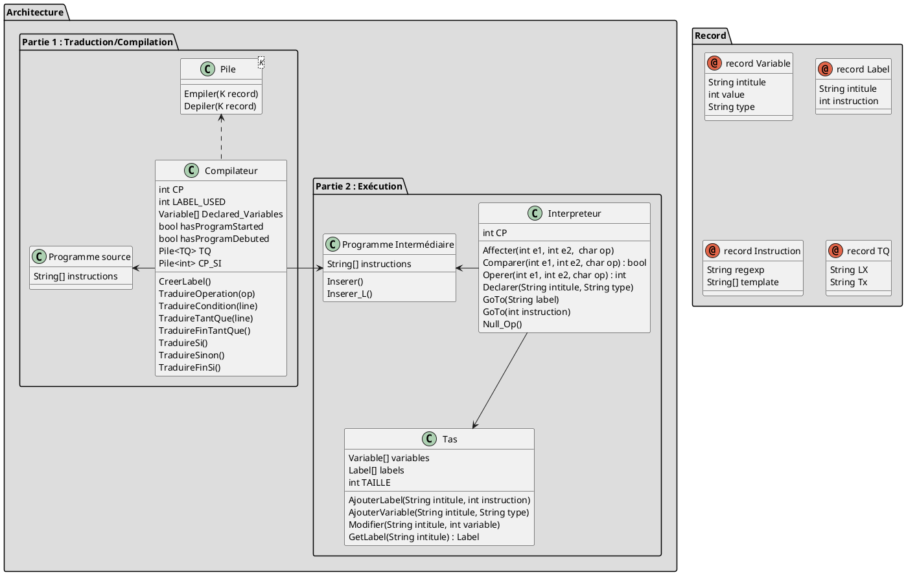

# interpreteur-code

## Architecture

```plantuml
@startuml

package "Architecture" #DDDDDD {


package "Partie 2 : Exécution" #DDDDDD {

class "Programme Intermédiaire" {
String[] instructions
Inserer()
Inserer_L()
}

class Tas {
Variable[] variables
Label[] labels
int TAILLE

AjouterLabel(String intitule, int instruction) 
AjouterVariable(String intitule, String type) 
Modifier(String intitule, int variable) 
GetLabel(String intitule) : Label
}

class Interpreteur {
int CP

Affecter(int e1, int e2,  char op)
Comparer(int e1, int e2, char op) : bool
Operer(int e1, int e2, char op) : int
Declarer(String intitule, String type)
GoTo(String label)
GoTo(int instruction)
Null_Op()
}

Interpreteur --> Tas : "\t\t\t\t\t\t\t\t\t\t\t\t"
"Programme Intermédiaire" <- Interpreteur

}

package "Partie 1 : Traduction/Compilation" #DDDDDD {

class "Programme source" {
String[] instructions
}

class Pile<K> {
    Empiler(K record)
    Depiler(K record)
}

class Compilateur {
int CP
int LABEL_USED
Variable[] Declared_Variables
bool hasProgramStarted
bool hasProgramDebuted
Pile<TQ> TQ
Pile<int> CP_SI
CreerLabel()
TraduireOperation(op)
TraduireCondition(line)
TraduireTantQue(line)
TraduireFinTantQue()
TraduireSi()
TraduireSinon()
TraduireFinSi()
}

Pile <.. Compilateur
"Programme source" <- Compilateur
Compilateur -> "Programme Intermédiaire"


}
}

package "Record" #DDDDDD {

annotation " record Variable" {
String intitule
int value
String type
}

annotation " record Label" {
String intitule
int instruction
}

annotation " record Instruction" {
String regexp
String[] template
}

annotation " record TQ" {
String LX
String Tx
}

}

@enduml
``` 
